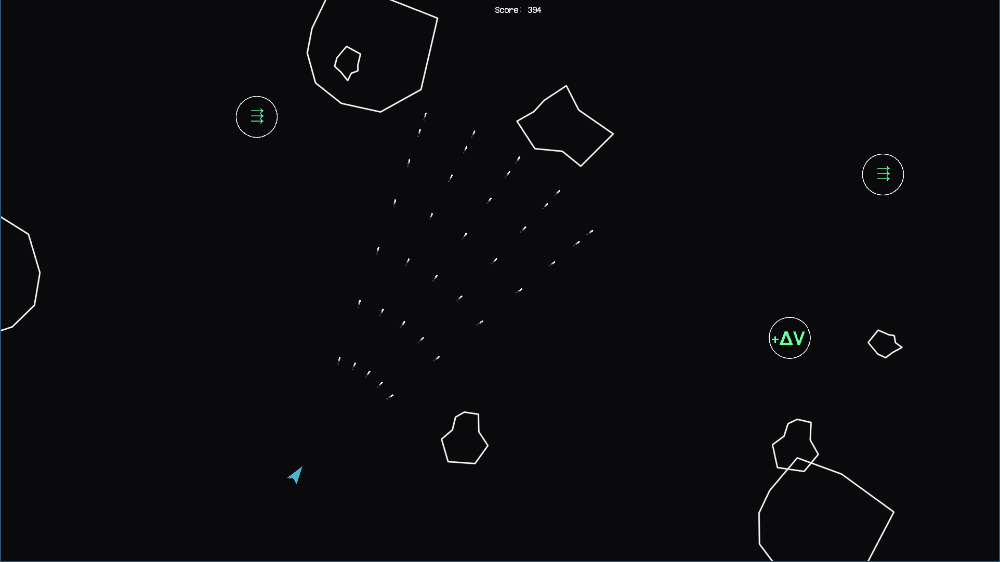
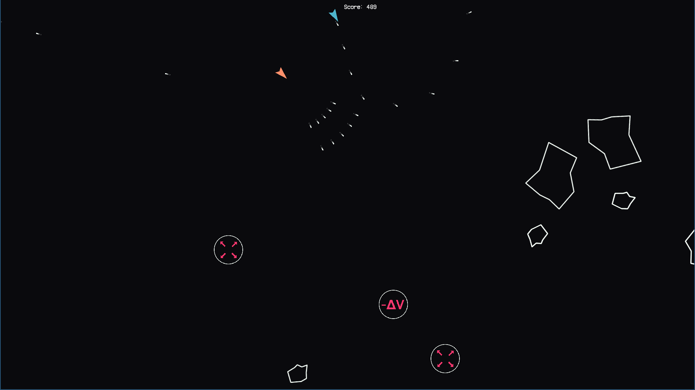

# asteroids
This project was made for the introductory C++/algorithm course [TDDC76 - Programming and Data Structures](https://www.ida.liu.se/~TDDC76/) given spring 2017. It is a remake/reinterpretation of the classic arcade game [Asteroids](https://en.wikipedia.org/wiki/Asteroids_(video_game)) with an added feature of power-ups. The program is built with C++ and [SFML](https://www.sfml-dev.org/).

## Building
The game is built buy invoking `make` from the repository root and the built binary output will be named *asteroids*. This software requires [SFML](https://www.sfml-dev.org/) to be built.

## Project participants
* Mikael Henriksson - [github.com/miklhh](https://github.com/miklhh)
* Arvid Larsson - [github.com/karvla](https://github.com/karvla)
* Christoffer Hejdström
* Max Jonsson
* Fredrik Jansson
* Emilia Knudsen

## Screenshots

